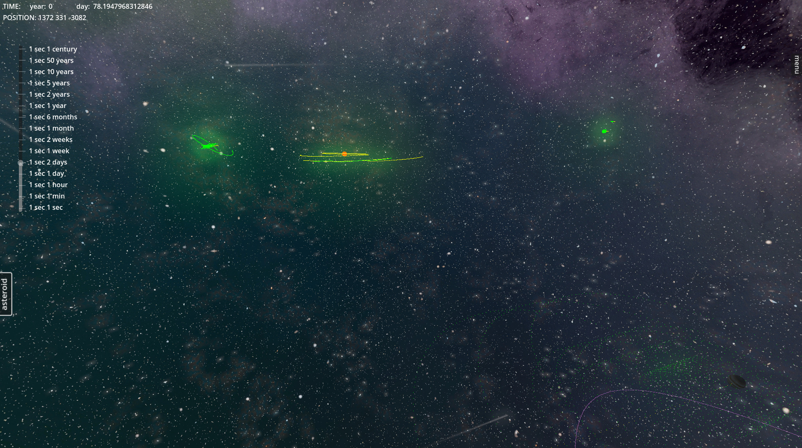
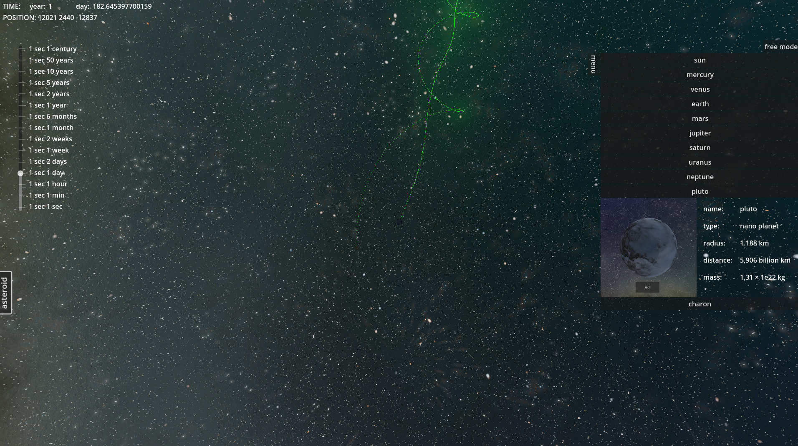
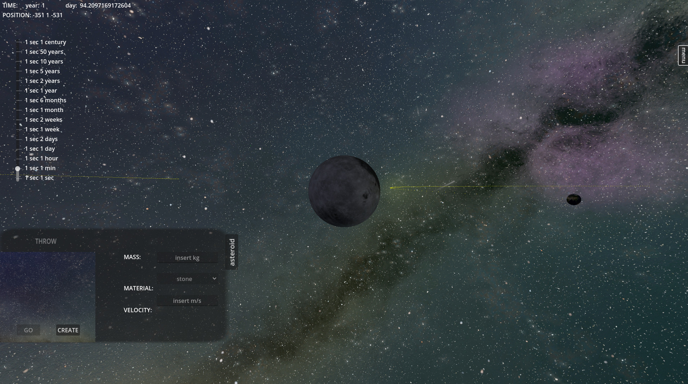
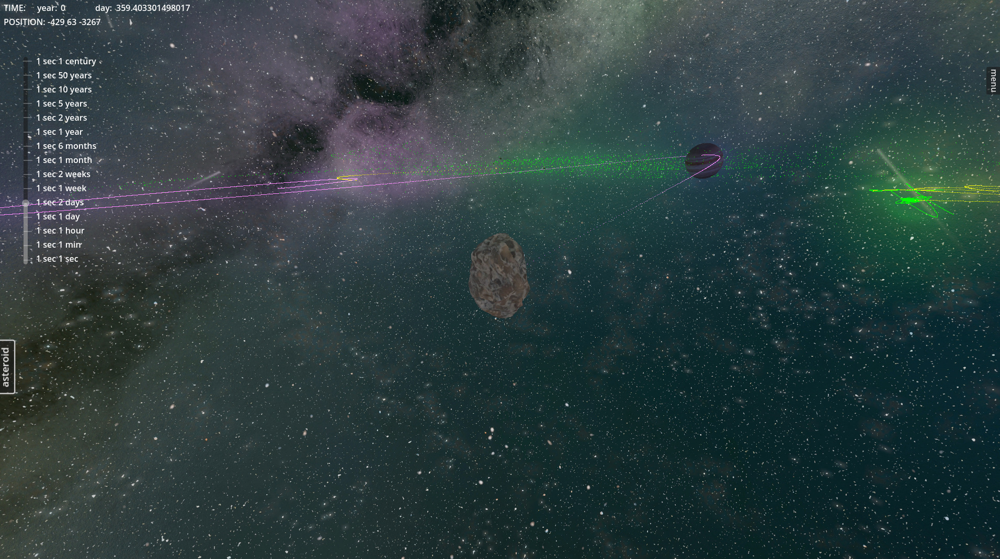
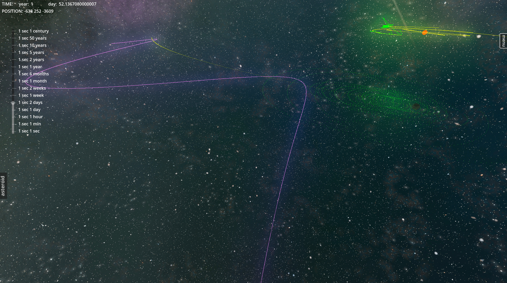

<div align="center">

# 🪐 Fisica Spazio

### An interactive 3D solar system built on real gravitational physics

Fly anywhere you want, click any planet to inspect it, scrub time from *one second per second*
up to *one century per second* — then throw an asteroid into the mix and watch gravity bend its path.




<sub>The whole system from far outside the ecliptic. Yellow lines are planetary orbits, green is the asteroid belt, magenta is a launched asteroid's trail.</sub>

</div>

---

## 📑 Contents

- [What it does](#-what-it-does)
- [Gallery](#-gallery)
- [Quick start](#-quick-start)
- [Controls](#-controls)
- [How to use it](#-how-to-use-it)
- [The physics](#-the-physics)
- [What's inside](#-whats-inside)
- [Troubleshooting](#-troubleshooting)
- [Credits](#-credits)

---

## ✨ What it does

|  | Feature |
|---|---|
| 🌍 | **27 celestial bodies** — the Sun, all 8 planets, the Pluto–Charon binary, and 17 major moons |
| 🧲 | **Real gravity** — every body pulls on every other one via `F = G·m₁m₂/r²`, no scripted orbits |
| ⏱️ | **15-step time scale** — from real time all the way to 1 century per second |
| ☄️ | **Launch your own asteroids** — pick a mass, a material and a speed, then watch where gravity takes it |
| 🛰️ | **Orbit trails** — every body and asteroid draws its own path so you can see the geometry |
| 🔍 | **Click-to-inspect** — radius, mass, type and orbital distance for any body |
| 🎥 | **Two camera modes** — free flight through the system, or lock on and orbit a single body |

---

## 📸 Gallery

<table>
<tr>
<td width="50%">

<p align="center"><sub><b>Inspect any body</b> — pick it from the menu and read its real radius, mass and distance from the Sun.</sub></p>
</td>
<td width="50%">

<p align="center"><sub><b>Build an asteroid</b> — set mass, material and velocity, preview it, then throw it.</sub></p>
</td>
</tr>
<tr>
<td width="50%">

<p align="center"><sub><b>Close encounter</b> — an asteroid drifting past a gas giant, orbit trails stretching to the horizon.</sub></p>
</td>
<td width="50%">

<p align="center"><sub><b>Gravity at work</b> — the magenta trail shows an asteroid whipping around the inner system and getting flung back out.</sub></p>
</td>
</tr>
</table>

---

## 🚀 Quick start

> **You need [Godot 4.4 (Standard)](https://godotengine.org/download).** The .NET/C# build is not required.
>
> This repo uses **Git LFS** for textures. Install it *before* cloning, or the images will come down as tiny text stubs.

```bash
# 1. one-time setup
git lfs install

# 2. clone
git clone https://github.com/NECKER55/solar_system.git
cd solar_system

# 3. open in Godot
#    Godot → Import → select solar_system/fisica_spazio/project.godot → Import & Edit
```

Then press **F5** (or the ▶ button) to run. The main scene is `scenes/main/space.tscn`.

> ⏳ **First launch is slow.** Godot has to import several 8K planet textures — expect a few minutes. It only happens once.

<details>
<summary><b>Already cloned without LFS?</b></summary>

```bash
git lfs install
git lfs pull
```
</details>

<details>
<summary><b>System requirements</b></summary>

| | Minimum | Recommended |
|---|---|---|
| **RAM** | 4 GB | 8 GB |
| **GPU** | OpenGL 3.3 / Vulkan capable | Any dedicated GPU |
| **OS** | Windows, macOS or Linux | — |

</details>

---

## 🎮 Controls

The camera behaves differently depending on whether you're flying freely or locked onto a body.

### Free flight (default)

| Input | Action |
|---|---|
| **Hold right mouse** | Enables flight — *required* for the keys below |
| **W / A / S / D** | Move forward / left / back / right |
| **Right mouse + move** | Look around |
| **Middle mouse + move** | Look around |
| **Scroll wheel** | Faster / slower movement (not zoom) |

> 💡 **The single most useful tip:** WASD does nothing on its own. **Hold the right mouse button** while you press it. Scroll to crank the speed up when crossing the outer system — the distances are enormous.

### Locked onto a body

| Input | Action |
|---|---|
| **Middle mouse + move** | Orbit around the body |
| **Scroll wheel** | Zoom in / out |

### Always available

| Input | Action |
|---|---|
| **↑ / ↓ arrows** | Step the time scale up / down |
| **Time slider** (left edge) | Jump straight to a speed, 1 sec → 1 century |
| **`menu` tab** (right edge) | Body list + info panel |
| **`asteroid` tab** (left edge) | Asteroid creator |

---

## 🛠 How to use it

<details open>
<summary><b>Controlling time</b></summary>

The slider on the left runs through 15 steps:

`1 sec` · `1 min` · `1 hour` · `1 day` · `2 days` · `1 week` · `2 weeks` · `1 month` · `6 months` · `1 year` · `2 years` · `5 years` · `10 years` · `50 years` · `1 century` **per real second**

The counter in the top-left shows elapsed simulated **years and days** (leap years included). Low speeds are good for watching moons; high speeds show the outer planets actually completing orbits.

</details>

<details open>
<summary><b>Inspecting a body</b></summary>

Open the **`menu`** tab on the right and pick a body. You get its name, type, radius, distance from its primary, and mass — all real values.

Press **`GO`** to fly the camera to it and lock on; press **`free mode`** to detach and return to free flight.

</details>

<details open>
<summary><b>Launching an asteroid</b></summary>

Open the **`asteroid`** tab on the left, then:

1. **MASS** — enter a value in kg
2. **MATERIAL** — `stone` (1500 kg/m³) or `iron` (7870 kg/m³); this sets the density, and therefore the size
3. **VELOCITY** — enter a speed in m/s
4. **CREATE** — spawns the asteroid in front of the camera so you can aim it
5. **THROW** — releases it into the simulation

It's launched along the direction the camera is facing and immediately starts feeling the gravity of every body in the system. Its trail is drawn as you go.

**Things worth trying:** aim just past Jupiter and see if you can get a gravity assist; try the same mass as stone and as iron; launch two asteroids on near-identical paths and watch them diverge.

</details>

---

## 🔬 The physics

Nothing here is on rails. Positions come out of the force calculation every frame.

**Newtonian gravitation**

$$F = G\frac{m_1 m_2}{r^2} \qquad G = 6.6743 \times 10^{-11}$$

Every body is attracted by every other body, so you get real orbital perturbations — not just clean two-body ellipses.

**Kepler's laws** emerge from that rather than being imposed: elliptical orbits with the primary at a focus, and bodies sweeping equal areas in equal times (visibly faster at perihelion).

**Real orbital elements** — semi-major axis, eccentricity and inclination are taken from NASA/JPL values for each body, which is why the orbits are tilted relative to each other rather than coplanar.

<details>
<summary><b>Scale conventions</b></summary>

| Quantity | Simulation unit |
|---|---|
| Distance | 1 Godot unit = 1 000 km |
| Mass | 1 unit = 1 000 kg |
| Gravitational constant | scaled to match the above |

</details>

---

## 📂 What's inside

```
solar_system/
├── docs/images/              # screenshots used in this README
└── fisica_spazio/            # ← the Godot project (open this)
    ├── project.godot
    ├── scripts/
    │   ├── classes/          # GLOBAL, celestialBody, planet, satellite, star, asteroid
    │   ├── main/             # space (physics loop), interface (UI), cam (camera)
    │   ├── planets/          # per-planet + per-moon parameters
    │   └── stars/
    ├── scenes/
    │   ├── main/             # space.tscn (main), interface.tscn, asteroid.tscn
    │   ├── planets/
    │   └── stars/
    ├── materials/            # planet textures (8K where available)
    ├── asteroid/             # asteroid meshes + iron/stone materials
    └── background/           # nebula HDR skybox
```

**Where to look first:** `scripts/main/space.gd` holds the gravity loop and the body registry. `scripts/classes/celestailBody.gd` is the base class every planet and moon extends. `scripts/classes/GLOBAL.gd` is the autoloaded singleton holding time state and the signal bus.

<details>
<summary><b>Full list of bodies</b></summary>

**Star** — Sun

**Planets** — Mercury · Venus · Earth · Mars · Jupiter · Saturn · Uranus · Neptune

**Dwarf planet** — Pluto (simulated as a true Pluto–Charon binary)

**Moons**
| Primary | Moons |
|---|---|
| Earth | Moon |
| Jupiter | Io, Europa, Ganymede, Callisto |
| Saturn | Titan, Rhea, Iapetus, Dione, Enceladus, Mimas |
| Uranus | Titania, Oberon, Umbriel, Ariel, Miranda |
| Neptune | Triton |
| Pluto | Charon |

</details>

<details>
<summary><b>Extending it</b></summary>

**Add a body:** duplicate an existing planet scene, swap the mesh and textures, set mass / radius / orbital elements in its script, then register it in `space.gd`.

**Tune the physics:** the orbital parameters (`a` semi-major axis, `e` eccentricity, inclination) live in each body's own script.

**Change the UI:** `scenes/main/interface.tscn` and `scripts/main/interface.gd`.

</details>

---

## 🐛 Troubleshooting

| Problem | Fix |
|---|---|
| **Textures are black / missing** | Git LFS wasn't set up. Run `git lfs install && git lfs pull`, then re-import in Godot. |
| **Project won't open** | You need Godot **4.4** specifically — 4.3 and earlier won't load it. |
| **WASD does nothing** | Hold the **right mouse button** while pressing them. |
| **I can't get anywhere, it's too slow** | Scroll up to increase movement speed — the outer system is very far away. |
| **The asteroid vanished** | Very small masses are hard to see. Try a larger mass, or lower the time scale before throwing. |
| **Runs slowly** | Lower the rendering quality in Godot's project settings; the 8K textures are demanding. |
| **Stuck in fullscreen** | The window mode is forced at `scripts/main/space.gd:65` — change it to `Window.MODE_WINDOWED`. |

---

## 🌱 Credits

Built for educational and research purposes as a hands-on way to study orbital mechanics.

- **Orbital data** — NASA / JPL published parameters
- **Planet textures** — astronomically accurate surface maps
- **Engine** — [Godot 4.4](https://godotengine.org)

**Ideas for where this could go next:** comets on extreme eccentric orbits · a more detailed ring system · relativistic correction for Mercury's perihelion · visualisation overlays for force and velocity vectors.

<div align="center">

---

**Enjoy exploring the solar system!** 🌟🪐🚀

</div>
